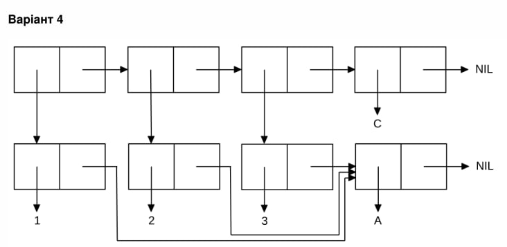

<p align="center"><b>МОНУ НТУУ КПІ ім. Ігоря Сікорського ФПМ СПіСКС</b></p>
<p align="center">
<b>Звіт з лабораторної роботи 1</b><br/>
"Обробка списків з використанням базових функцій"<br/>
дисципліни "Вступ до функціонального програмування"
</p>
<p align="right"><b>Студент(-ка)</b>: Литвин Максим Ігорович КВ-23</p>
<p align="right"><b>Рік</b>: 2025</p>

## Мета лабораторної роботи:
Ознайомитись із базовими типами даних та функціями Common Lisp, отримати практичні навички роботи зі списками.
## Загальне завдання
```lisp
CL-USER> (setq mylist (list 1 'a (cons 2 '(3)) '() (list 'end 'list)))
(1 A (2 3) NIL (END LIST))

;; Отримайте голову списку
CL-USER> (car mylist)
1

;; Отримайте хвіст списку
CL-USER> (cdr mylist)
(A (2 3) NIL (END LIST))

;; Отримайте третій елемент списку
;; 1 спосіб
CL-USER> (car (cddr mylist)) 
(2 3)

;; 2 спосіб
CL-USER> (nth 2 mylist)
(2 3)

;; Отримайте останній елемент списку
CL-USER> (car (last mylist))
(END LIST)

;; Використання atom
;; 1 спосіб
CL-USER> (atom 10)
T

;; 2 спосіб
CL-USER> (atom 'a)
T

;; 3 спосіб
CL-USER> (atom 'nil)
T

;; Використання listp
;; 1 спосіб
CL-USER> (listp mylist)
T

;; 2 спосіб
CL-USER> (listp '())
T

;; 3 спосіб
CL-USER> (listp 'a)
F

;;Інші предикати

;;Рівність структур
CL-USER> (equal '('A 'B) '('A 'B))
T

;;Чи це число?
CL-USER> (numberp '123)
T

;;Чи це символ?
CL-USER> (symbolp 'a)
T

;;Чи це нуль?
CL-USER> (null '())
T

;;З'єднання списку з не пустим підсписком
CL-USER> (append mylist (nth 2 mylist))
(1 A (2 3) NIL (END LIST) 2 3)
```

## Варіант 12 (4)
<p align="center">

</p>

Список має вигляд: ((1 А) (2 А) (3 А) С)
```lisp
CL-USER> (let ((x '(A))) ;; (A nil) - список, а отже й прописуємо його як список (через квотування)
CL-USER> (list (cons 1 x) (cons 2 x) (cons 3 x) 'C)) ;; cons (a, b) = [a, b]: a - car, b - cdr.
((1 A) (2 A) (3 A) C)

```