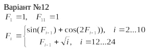

<p align="center"><b>МОНУ НТУУ КПІ ім. Ігоря Сікорського ФПМ СПіСКС</b></p>
<p align="center">
<b>Звіт з Розрахунково-Графічної Роботи</b><br/>
<br/>
з дисципліни "Вступ до функціонального програмування"
</p>
<p align="right"><b>Студент</b>: Литвин Максим Ігорович КВ-23</p>
<p align="right"><b>Рік</b>: 2025</p>

## Завдання на розрахунково-графічну роботу
```
Реалізувати програму для обчислення функції згідно варіанту мовою Common Lisp.
Варіант обирається згідно списку варіантів для лабораторних робіт за модулем 16:
1 -> 1, 2 -> 2, ..., 17 -> 1, 18 -> 2 і т.д.
2. Виконати тестування реалізованої програми.
3. Порівняти результати роботи програми мовою Common Lisp с розрахунками
іншими засобами.
```
## Варіант 12
<p align="center">

</p>

## Лістинг реалізації завдання
```lisp
(defun compute-f-seq ()
  (let ((f (make-array 25 :element-type 'double-float :initial-element 0d0)))
    (setf (aref f 1) 1d0)

    (loop for i from 2 to 10 do
      (let ((prev (aref f (1- i))))
        (setf (aref f i)
              (+ (sin prev)
                 (cos (* 2d0 prev))))))

    (setf (aref f 11) 1d0)

    (loop for i from 12 to 24 do
      (setf (aref f i)
            (+ (aref f (1- i))
               (sqrt (float i 1d0)))))

    f))

(defun print-f-seq (&optional (f (compute-f-seq)))
  (format t "~& i        Fi~%----------------------~%")
  (loop for i from 1 to 24 do
    (format t "~2d  ~,12f~%" i (aref f i)))
  f)
```
### Тестові набори та утиліти
```lisp
(defun approx= (a b &optional (eps 1d-12))
  (< (abs (- a b)) eps))

(defun run-tests ()
  (let ((f (compute-f-seq)))
    (assert (approx= (aref f 1) 1d0))
    (assert (approx= (aref f 11) 1d0))
    (assert (approx= (aref f 2) 0.4253241482607541d0 1d-12))
    (assert (approx= (aref f 10) 0.27531074681339274d0 1d-12))
    (assert (approx= (aref f 24) 55.84887729851865d0 1d-12))

    (format t "~&All tests passed.~%")
    t))
```
### Перевірка результатів

#### results.csv
```
| i = 2 … 10 | I = 12 … 24 |  |       |   |
| ---------- | ----------- |  | ----- | - |
| 0,425324   | 4,464102    |  | F1 =  | 1 |
| 1,072112   | 8,069653    |  | F11 = | 1 |
| 0,335698   | 11,81131    |  |       |   |
| 1,112382   | 15,68429    |  |       |   |
| 0,288415   | 19,68429    |  |       |   |
| 1,122629   | 23,8074     |  |       |   |
| 0,276766   | 28,05004    |  |       |   |
| 1,123919   | 32,40894    |  |       |   |
| 0,275311   | 36,88107    |  |       |   |
|            | 41,46365    |  |       |   |
|            | 46,15407    |  |       |   |
|            | 50,9499     |  |       |   |
|            | 55,84888    |  |       |   |
```

#### task.lisp
```lisp
CL-USER> (print-f-seq)
i        Fi
----------------------
 1  1.000000000000
 2  0.425324148261
 3  1.072112026451
 4  0.335697903261
 5  1.112382323110
 6  0.288414723186
 7  1.122628766685
 8  0.276766052053
 9  1.123919227850
10  0.275310746813
11  1.000000000000
12  4.464101615138
13  8.069652890602
14  11.811310277376
15  15.684293623583
16  19.684293623583
17  23.807399249201
18  28.050039936320
19  32.408938879861
20  36.881074834860
21  41.463650529816
22  46.154066289640
23  50.949897812952
24  55.848877298519
``` 

### Тестування
```lisp
CL-USER> (run-tests)

All tests passed.
```